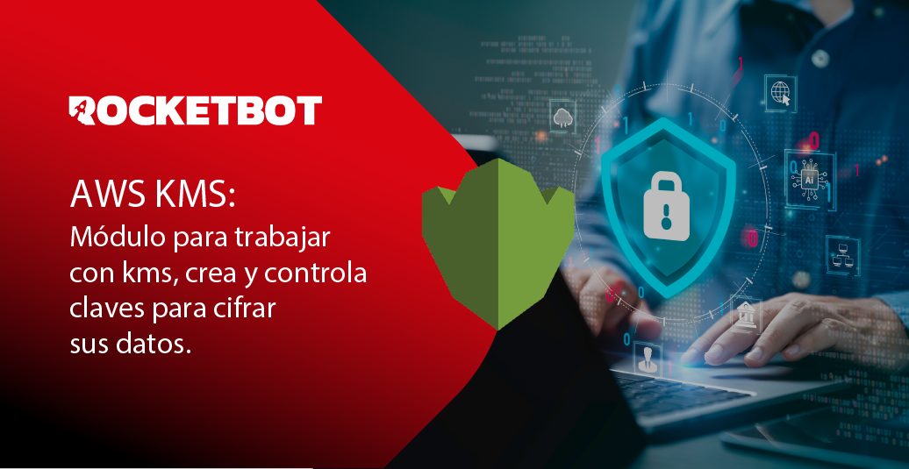

# AWS_KMS
  
Módulo para trabajar con kms, crea y controla claves para cifrar sus datos.  

*Read this in other languages: [English](Manual_AWS_KMS.md), [Português](Manual_AWS_KMS.pr.md), [Español](Manual_AWS_KMS.es.md)*

## Como instalar este módulo
  
Para instalar el módulo en Rocketbot Studio, se puede hacer de dos formas:
1. Manual: __Descargar__ el archivo .zip y descomprimirlo en la carpeta modules. El nombre de la carpeta debe ser el mismo al del módulo y dentro debe tener los siguientes archivos y carpetas: \__init__.py, package.json, docs, example y libs. Si tiene abierta la aplicación, refresca el navegador para poder utilizar el nuevo modulo.
2. Automática: Al ingresar a Rocketbot Studio sobre el margen derecho encontrara la sección de **Addons**, seleccionar **Install Mods**, buscar el modulo deseado y presionar install.  

## Como usar este modulo

1. Crear una cuenta de AWS (saltear este paso si ya posede una cuenta). Visita https://aws.amazon.com/ Haz clic en "Crear una cuenta de AWS". Sigue las instrucciones para registrarte, proporcionando la información solicitada

2. Inicia sesión en la Consola de administración de AWS: https://aws.amazon.com/es/console/ y navega a la consola **IAM**.

3. Haz clic en **Usuarios** y luego en **Crear usuario**

4. En **Detalles de Usuario** proporciona un nombre de usuario y dar click a Siguiente.

5. En **Establecer permisos** elegir la opción **Adjuntar políticas directamente** y debajo adjuntar las políticas **AdministratorAccess** y **AWSKeyManagementServicePowerUser**. Dar click a Siguiente y luego en **Crear Usuario**

6. Ir al perfil (esquina superior derecha) y hacer click en Credenciales de seguridad.

7. Busca el apartado **Access keys** y presiona **Crear acces key**. 

8. Se abrirá una verificación **Alternativas a las claves de acceso del usuario root**, darle check y presionar **Crear claves de acceso**.

**Importante**: Anota en un lugar seguro el Access Key ID y la Secret Access Key. Necesitarás ambos para configurar el módulo.

## Descripción de los comandos

### Conexion a Aws
  
Ingrese los datos para la conexion
|Parámetros|Descripción|ejemplo|
| --- | --- | --- |
|Access Key Id|El ID de acceso obtenido al crear las credenciales||
|Secret Access Key|Valor del secreto obtenido al crear las credenciales||
|Region|Nombre de la región AWS.|us-west-2|
|Asignar resultado a Variable|Variable donde se almacenara el estado de la conexion, devuelve True si es exitosa o False en el caso contrario|Variable|

### Generar ID de Llave
  
Se utiliza para encriptar y desencriptar datos
|Parámetros|Descripción|ejemplo|
| --- | --- | --- |
|Descripción|Opcional. Descripción de la llave a generar.|Variable|
|Asignar resultado a Variable|Variable donde se almacenara el resultado|Variable|

### Encriptar
  
Encriptar texto plano
|Parámetros|Descripción|ejemplo|
| --- | --- | --- |
|ID de la Llave|ID de la llave||
|Texto a encriptar|Texto plano que se quiere encriptar||
|Asignar resultado a Variable|Variable donde se almacenara el texto encriptado|Variable|

### Desencriptar
  

|Parámetros|Descripción|ejemplo|
| --- | --- | --- |
|Texto a desencriptar|Se usa el resultado del comando Encriptar, que es el texto que se encriptó.||
|Asignar resultado a Variable|Variable donde se guardará el texto desencriptado|Variable|

### Listar claves
  
Lista todas las claves KMS disponibles en tu cuenta.
|Parámetros|Descripción|ejemplo|
| --- | --- | --- |
|Asignar resultado a Variable|Variable donde se almacenara las key id junto con su descripción en caso de tenerla.|Variable|
