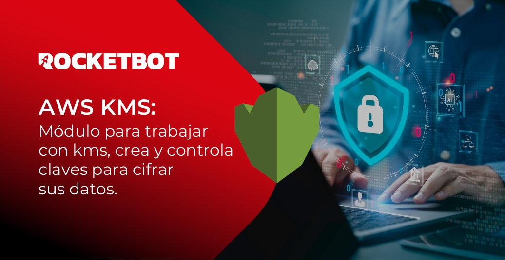

# AWS_KMS
  
Módulo para trabalhar com kms, cria e controla chaves para criptografar seus dados  

*Read this in other languages: [English](Manual_AWS_KMS.md), [Português](Manual_AWS_KMS.pr.md), [Español](Manual_AWS_KMS.es.md)*
  

## Como instalar este módulo
  
Para instalar o módulo no Rocketbot Studio, pode ser feito de duas formas:
1. Manual: __Baixe__ o arquivo .zip e descompacte-o na pasta módulos. O nome da pasta deve ser o mesmo do módulo e dentro dela devem ter os seguintes arquivos e pastas: \__init__.py, package.json, docs, example e libs. Se você tiver o aplicativo aberto, atualize seu navegador para poder usar o novo módulo.
2. Automático: Ao entrar no Rocketbot Studio na margem direita você encontrará a seção **Addons**, selecione **Install Mods**, procure o módulo desejado e aperte instalar.  

## Como usar este módulo

1. Crie uma conta AWS (pule esta etapa se você já tiver uma conta). Visite https://aws.amazon.com/ Clique em “Criar uma conta AWS”. Siga as instruções para se cadastrar, fornecendo as informações solicitadas

2. Faça login no Console de gerenciamento da AWS: https://aws.amazon.com/es/console/ e navegue até o console do **IAM**.

3. Clique em **Usuários** e depois em **Criar usuário**

4. Em **Detalhes do usuário** forneça um nome de usuário e clique em Avançar.

5. Em **Definir permissões** escolha a opção **Anexar políticas diretamente** e abaixo anexe as políticas **AdministratorAccess** e **AWSKeyManagementServicePowerUser**. Clique em Avançar e em **Criar usuário**

6. Acesse o perfil (canto superior direito) e clique em Credenciais de segurança.

7. Encontre a seção **Chaves de acesso** e pressione **Criar chave de acesso**.

8. Uma marca será aberta **Alternativas às chaves de acesso do usuário root**, clique em verificar e pressione **Criar chaves de 
acesso**.

**Importante**: Anote o ID da chave de acesso e a chave de acesso secreta em um local seguro. Você precisará de ambos para configurar o módulo.
## Descrição do comando

### Conexão com Aws
  
Insira os dados para a conexão
|Parâmetros|Descrição|exemplo|
| --- | --- | --- |
|Access Key Id|O ID de acesso obtido ao criar as credenciais||
|Secret Access Key|Valor do secreto obtido ao criar as credenciais||
|Região|Nome da região AWS.|us-west-2|
|Atribuir resultado à variável|Variável onde será armazenado o estado da conexão, retorna True se for bem sucedida ou False caso contrário|Variable|

### Gerar ID da Chave
  
Usado para encriptar e desencriptar dados
|Parâmetros|Descrição|exemplo|
| --- | --- | --- |
|Descrição|Opcional. Descrição da chave a gerar.|Variable|
|Atribuir resultado à variável|Variável onde o resultado será armazenado|Variable|

### Encriptar
  
Encriptar texto plano
|Parâmetros|Descrição|exemplo|
| --- | --- | --- |
|Chave ID|ID da chave||
|Texto a encriptar|Texto plano que se deseja encriptar||
|Atribuir resultado à variável|Variável onde será armazenado o texto encriptado|Variable|

### Desencriptar
  

|Parâmetros|Descrição|exemplo|
| --- | --- | --- |
|Texto a desencriptar|Usa o resultado do comando Encriptar, que é o texto que foi criptografado.||
|Atribuir resultado à variável|Variável onde será armazenado o texto desencriptado|Variable|

### Listar Chaves
  
Listar todas as chaves KMS disponíveis na sua conta
|Parâmetros|Descrição|exemplo|
| --- | --- | --- |
|Atribuir resultado à variável|Variável onde será armazenado o ID da chave e descrição, caso tenha.|Variable|
